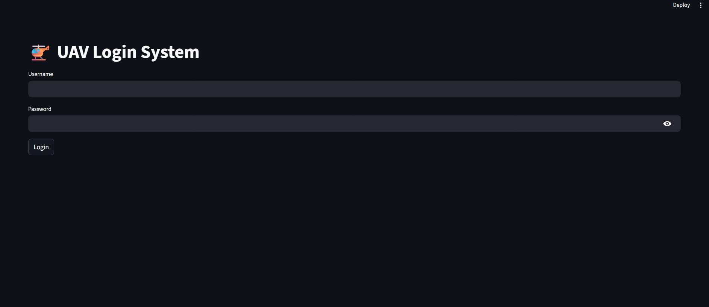
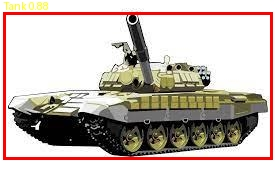
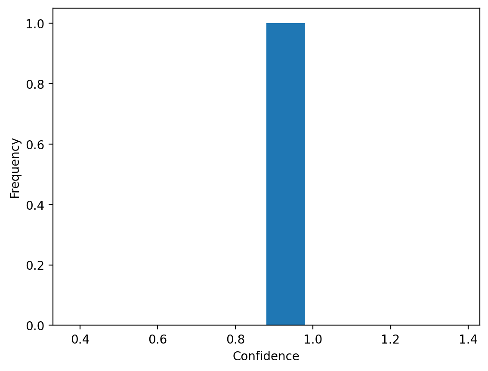
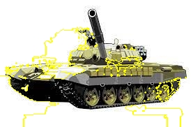

# 🚁 UAV War Object Detection System

## 📌 Overview

This project implements a **YOLO-based UAV object detection system** designed for military/war-related object recognition from aerial imagery.

It supports:

* Real-time UAV detection
* Image upload detection
* Live webcam inference
* English mapping of Russian-trained labels
* Confidence histogram visualization
* Explainable AI (LIME visualization)
* Streamlit web deployment
* Secure login system

---

## 🧠 Detected Classes

| Russian Label | English Equivalent        |
| ------------- | ------------------------- |
| artilleriya   | Artillery                 |
| bmp           | Infantry Fighting Vehicle |
| bpla          | UAV / Drone               |
| bronemashina  | Armored Vehicle           |
| btr           | Armored Personnel Carrier |
| pehota        | Infantry / Soldier        |
| rszo          | MLRS                      |
| tank          | Tank                      |

---

## 🚀 Features

### Detection

* YOLO-based object detection
* UAV aerial imagery optimized
* Confidence threshold control

### Deployment

* Streamlit web interface
* Login/logout authentication
* Image upload detection
* Live camera detection

### Explainability

* Confidence histogram
* LIME explanation visualization

---

## 📷 Screenshots

### Login Page



### Detection Example



### Confidence Histogram



### LIME Explanation



---

## ⚙️ Installation

### Clone repository

```bash
git clone https://github.com/YOUR_USERNAME/uav-war-object-detection.git
cd uav-war-object-detection
```

### Install dependencies

```bash
pip install -r requirements.txt
```

---

## ▶️ Run Application

```bash
streamlit run app.py
```

---

## 🔑 Login Credentials (Demo)

Username:

```
admin
```

Password:

```
admin123
```

---

## ⚠️ Notes

* Live camera works locally only.
* Streamlit Cloud supports image upload detection only.
* Model weights are required inside:

```
weights/best.pt
```

---

## 🛰️ Future Improvements

* Deep SORT tracking
* Video file detection
* UAV real-time optimization
* Larger training dataset
* Cloud GPU deployment

---

## 📜 License

MIT License

---

## 👨‍💻 Author

AI UAV Detection Research Project
